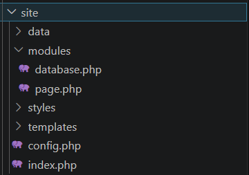
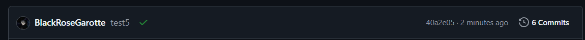

# IWNO8: Непрерывная интеграция с помощью Github Actions

## Цель работы

В рамках данной работы студенты научатся настраивать непрерывную интеграцию с помощью Github Actions.

## Задание

Создать Web приложение, написать тесты для него и настроить непрерывную интеграцию с помощью Github Actions на базе контейнеров.

## Ход работы

### Подготовка репозитория и структуры проекта

Был создан репозиторий `containers08` и клонирован на локальную машину. В корне проекта создана директория `./site` для размещения исходного кода PHP-приложения.



### Разработка Web-приложения

В директории `./site` реализовано модульное PHP-приложение. Файл modules/database.php содержит класс Database, инкапсулирующий работу с SQLite через PDO. Конструктор принимает путь к файлу БД, а методы `Execute()`, `Fetch()`, `Create()`, `Read()`, `Update()`, `Delete()` и `Count()` обеспечивают выполнение запросов и CRUD-операции с использованием подготовленных выражений:

```php
class Database {
    private PDO $pdo;
    public function __construct(string $path) {
        $this->pdo = new PDO('sqlite:' . $path);
        $this->pdo->setAttribute(PDO::ATTR_ERRMODE, PDO::ERRMODE_EXCEPTION);
    }
    public function Create(string $table, array $data): int {
        $cols = implode(', ', array_keys($data));
        $ph = ':' . implode(', :', array_keys($data));
        $stmt = $this->pdo->prepare("INSERT INTO $table ($cols) VALUES ($ph)");
        $stmt->execute($data);
        return (int) $this->pdo->lastInsertId();
    }
}
```

Файл `modules/page.php` содержит класс Page, принимающий путь к шаблону в конструкторе и реализующий метод `Render()`, который использует `extract()` и буферизацию вывода для подстановки данных:

```php
class Page {
    private string $templatePath;
    public function __construct(string $template) { $this->templatePath = $template; }
    public function Render(array $data): string {
        extract($data);
        ob_start();
        include $this->templatePath;
        return ob_get_clean();
    }
}
```

Файл `config.php` возвращает массив с настройками подключения к БД, а `index.php` выступает точкой входа, инициализирующей классы и выводящей отрендеренную страницу:

```php
$db = new Database($config['db']['path']);
$page = new Page(__DIR__ . '/templates/index.tpl');
$data = $db->Read('page', $_GET['page'] ?? 1);
echo $page->Render($data);
```

Шаблон `templates/index.tpl` содержит базовую HTML-разметку с переменными `$title`, `$content`, `$count`, а файл `styles/style.css` задаёт визуальное оформление.


### Подготовка схемы базы данных

В корневой директории создана папка `./sql` с файлом `schema.sql`, содержащим SQL-скрипт для создания таблицы page и заполнения её тестовыми данными.

```sql
CREATE TABLE page (
    id INTEGER PRIMARY KEY AUTOINCREMENT,
    title TEXT,
    content TEXT
);

INSERT INTO page (title, content) VALUES ('Page 1', 'Content 1');
INSERT INTO page (title, content) VALUES ('Page 2', 'Content 2');
INSERT INTO page (title, content) VALUES ('Page 3', 'Content 3');
```

### Написание тестов

В директории `./tests` реализована система тестирования. Файл `testframework.php` определяет функции логирования, универсальную проверку `assertExpression()` и класс `TestFramework`, управляющий регистрацией и запуском тестов с подсчётом успешных выполнений. Файл `tests.php` подключает зависимости и регистрирует 10 тестов. Для изоляции данных используется вспомогательная функция, создающая временную БД в системной директории:

```php
function getTestDb(): Database {
    $path = sys_get_temp_dir() . '/test_' . uniqid() . '.db';
    $db = new Database($path);
    $db->Execute('CREATE TABLE test_items (id INTEGER PRIMARY KEY, name TEXT, value INTEGER)');
    return $db;
}
```

Ключевые тесты проверяют корректность работы классов. Например, проверка соединения и метода добавления записи:

```php
function testDbConnection() {
    $db = getTestDb();
    return assertExpression($db->Execute('SELECT 1') !== false, 'DB OK', 'DB fail');
}
function testDbCreate() {
    $db = getTestDb();
    $id = $db->Create('test_items', ['name' => 'test', 'value' => 42]);
    $row = $db->Read('test_items', $id);
    return assertExpression($row['name'] === 'test', 'Create OK', 'Create fail');
}
```

Тест рендеринга подставляет данные в шаблон и сверяет вывод:

```php
function testPageRender() {
    $page = new Page(__DIR__ . '/../templates/index.tpl');
    $out = $page->Render(['title' => 'Test', 'content' => '<p>OK</p>', 'count' => 5]);
    return assertExpression(strpos($out, 'Test') !== false, 'Render OK', 'Render fail');
}
```

Остальные тесты аналогично покрывают все методы классов. После выполнения рабочего процесса GitHub Actions выводится итоговый отчёт в формате "X / 10", где X - количество успешно пройденных тестов из десяти.

### Создание Dockerfile

В корне проекта добавлен Dockerfile, который:
- использует образ php:7.4-fpm как базовый;
- устанавливает SQLite и расширение pdo_sqlite;
- копирует schema.sql и инициализирует базу данных;
- копирует исходный код приложения в /var/www/html.

```dockerfile
FROM php:7.4-fpm as base

RUN apt-get update && \
    apt-get install -y sqlite3 libsqlite3-dev && \
    docker-php-ext-install pdo_sqlite

VOLUME ["/var/www/db"]

COPY sql/schema.sql /var/www/db/schema.sql

RUN echo "prepare database" && \
    cat /var/www/db/schema.sql | sqlite3 /var/www/db/db.sqlite && \
    chmod 777 /var/www/db/db.sqlite && \
    rm -rf /var/www/db/schema.sql && \
    echo "database is ready"

COPY site /var/www/html
```

### Настройка GitHub Actions

Создан файл .github/workflows/main.yml, описывающий рабочий процесс CI:
- сборка Docker-образа;
- создание и запуск контейнера;
- копирование тестов в контейнер;
- выполнение тестов через php /var/www/html/tests/tests.php;
- остановка и удаление контейнера после завершения.

```yml
name: CI

on:
  push:
    branches:
      - main

jobs:
  build:
    runs-on: ubuntu-latest
    steps:
      - name: Checkout
        uses: actions/checkout@v4
      - name: Build the Docker image
        run: docker build -t containers08 .
      - name: Create `container`
        run: docker create --name container --volume database:/var/www/db containers08
      - name: Copy tests to the container
        run: docker cp ./tests container:/var/www/html
      - name: Up the container
        run: docker start container
      - name: Run tests
        run: docker exec container php /var/www/html/tests/tests.php
      - name: Stop the container
        run: docker stop container
      - name: Remove the container
        run: docker rm container
```

### Запуск и тестирование

После отправления изменений в репозиторий тесты проходят успешно.



### Ответы на вопросы

**1. Что такое непрерывная интеграция?**  
Непрерывная интеграция - это когда изменения кода автоматически собираются и проверяются при каждом добавлении в общий репозиторий. Этот процесс позволяет выявлять ошибки интеграции на ранних этапах, сокращая время на их исправление.

**2. Для чего нужны юнит-тесты? Как часто их нужно запускать?**  
Юнит-тесты предназначены для автоматической проверки корректности работы отдельных изолированных модулей или функций программы. Их следует запускать при каждом коммите и в рамках процесса непрерывной интеграции, чтобы мгновенно получать обратную связь о работоспособности кода. Регулярное выполнение таких тестов предотвращает накопление скрытых дефектов и упрощает процесс рефакторинга.

**3. Что нужно изменить в файле .github/workflows/main.yml для того, чтобы тесты запускались при каждом создании запроса на слияние (Pull Request)?**  
В секции `on` файла конфигурации необходимо заменить триггер `push` на `pull_request` или добавить его в список событий. Это изменение свяжет запуск рабочего процесса с созданием или обновлением запроса на слияние в репозитории.

**4. Что нужно добавить в файл .github/workflows/main.yml для того, чтобы удалять созданные образы после выполнения тестов?**  
В конец секции `steps` рабочего процесса следует добавить новый шаг с командой удаления образа через `docker rmi` по его тегу или идентификатору.